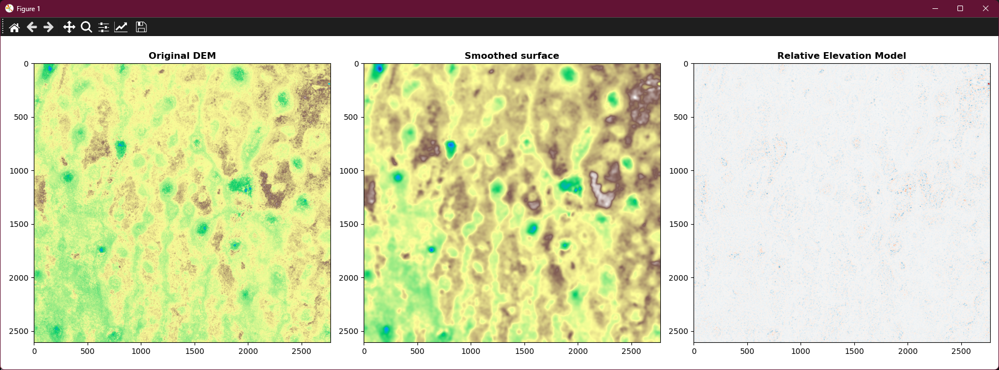
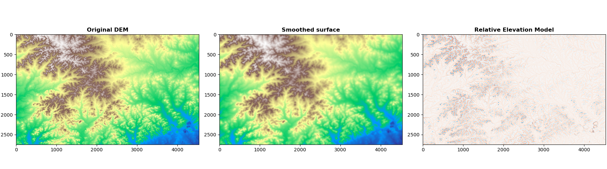
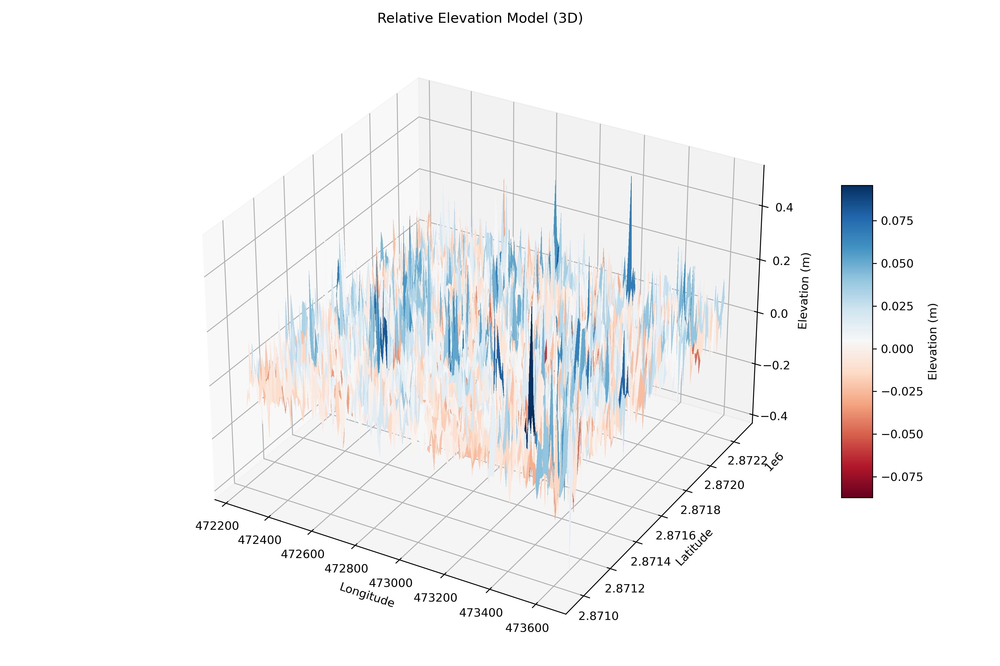
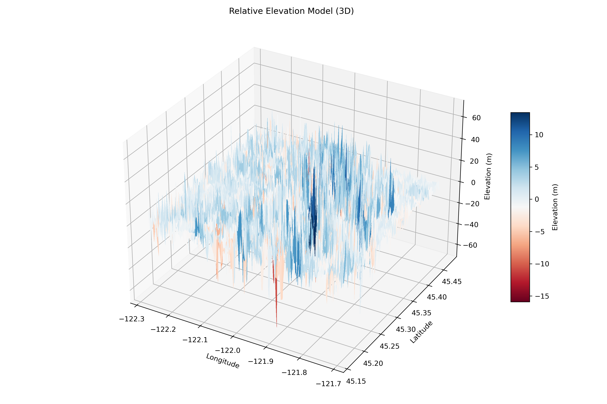
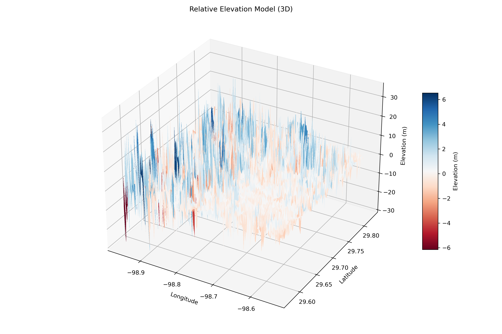

# Relative Elevation Model

This project provides tools for generating and visualizing Relative Elevation Models (REMs) from Digital Elevation Model (DEM) data using Python. It includes scripts for both 2D and 3D visualization of terrain features.

## Features

- **rem.py**: Generates a REM by smoothing a DEM and subtracting the smoothed surface from the original. Outputs both visualizations and a new GeoTIFF.
- **static.py**: Loads a REM GeoTIFF and creates a 3D surface plot for enhanced visualization.

## Requirements

- Python 3.x
- numpy
- rasterio
- matplotlib
- scipy

Install dependencies with:

```bash
pip install numpy rasterio matplotlib scipy
```

## Usage

### 1. Generate a Relative Elevation Model

Place your DEM file (e.g., `mthood.tif`) in the `input/` directory.(What it currently is, want to change the format where user picks the tif file.)

Run:

```bash
python rem.py
```

This will create a REM GeoTIFF in the `output/` directory and display 2D plots of the original DEM, smoothed DEM, and REM.

### 2. Visualize REM in 3D

Ensure you have a REM GeoTIFF (e.g., `output/tex.tif`).

Run:

```bash
python static.py
```

This will generate a 3D surface plot and save it as a PNG in the `3d_render/` directory.

## File Structure

- `rem.py` — Generate REM from DEM and save as GeoTIFF
- `static.py` — 3D visualization of REM
- `input/` — Place your input DEM files here
- `output/` — Output GeoTIFFs are saved here
- `3d_render/` — 3D PNG images are saved here

## Examples

### REM near the Everglades in Florida

- The DEM and smoothed map show low-relief terrain (flat landscape).
- REM is very faint, which is expected in flat wetland areas.
- Only small patches of relative elevation differences, likely tree islands, levees, or anthropogenic features.

### REM of Mount Hood in Oragon 

- Clearly a mountainous region, likely volcanic terrain.
- REM highlights valley bottoms, ridges, and drainage patterns.
- High contrast REM suggests a complex terrain with strong local relief, ideal for hydrological modeling or identifying glacial valleys.

### REM near Camp Bull in Texas

- Terrain looks rugged with dense ridge networks.
- The REM shows complex micro-topography, possibly dissected uplands or hilly terrain.

### 3D REM of the Everglades

- Elevation range: -0.4 to +0.4 meters.
- Use case: Useful for wetland microtopography, archaeological surveys, or precise engineering like flood modeling.

### 3D REM of Mount Hood

- Elevation range: Z-axis ranges roughly from -60 to +60 meters. This suggests relatively rugged terrain—maybe forested or mountainous.
- Use case: Could be used for landslide detection, trail planning, or forest topography studies.

### 3D REM near Camp Bulls

- Elevation range: Around -30 to +30 meters. Shows some terrain variation but not mountainous, maybe rolling hills, urban zones, or floodplains.
- Use case: Could support urban planning, drainage studies, or land cover classification.


## Notes

- Adjust the `sigma` parameter in `rem.py` for different smoothing levels.
- The `step` parameter in `static.py` controls 3D plot resolution (lower for higher quality, higher for faster rendering).
- `threedee.py` doesn't seem to work for me, just gives me a blank graph. 

